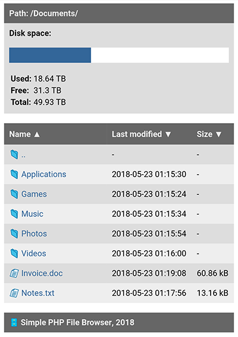

# About
**Simple PHP File Browser** is a tiny web application that helps you to browse your files uploaded on your web server.

## Features
- Very small code size (less than 9 kB)
- Sort your folders and files by name, date or size (ascending / descending)
- Disk usage
- Responsive mobile design

## Installation

These installation instructions are for Debian Linux 11.x:

1. Run the following commands to download the source code:

```console
apt update
apt -y upgrade
apt -y install git
git clone https://github.com/libersoft-org/simple-php-file-browser.git
```

2. Edit the file named "settings.php" in "simple-php-file-browser/src/" folder and set the following:
- $basedir - your base directory where your files will be stored (default: "./files")
- $allow_parent - allow (true) or deny (false) users to use 2 dots (..) in URL to access parent directory (default: "false")
- $template - the name of your HTML template folder located in "templates" folder (default: "default")
- $diskinfo - show (true) or hide (false) disk usage info in page header (default: "true")

3. Move the content of the "simple-php-file-browser" folder to your web root

4. Open your web server address in your web broswer

## Screenshot
<p align="center">
 
</p>

## License
This software is developed as open source under [**Unlicense**](./LICENSE).

## Donations

Donations are important to support the ongoing development and maintenance of our open source projects. Your contributions help us cover costs and support our team in improving our software. We appreciate any support you can offer.

To find out how to donate our projects, please navigate here:

[](https://libersoft.org/donations)

Thank you for being a part of our projects' success!
